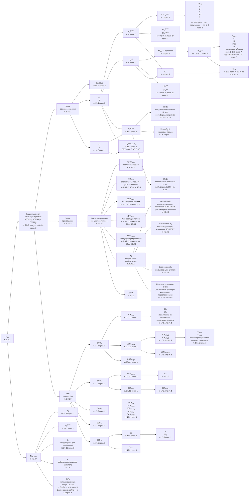

```mermaid
flowchart LR
    N["N<sub>нж</sub><br/>п. 6.3.2"]

    N --> Core["Корреляционная агрегация 3 рисков:<br/>√(Σ corr<sub>i,j</sub> × ТКНЖ<sub>i</sub> × ТКНЖ<sub>j</sub>)<br/>п. 6.3.2; corr<sub>i,j</sub> — табл. 24 прил. 2"]
    N --> NOSAGO["N<sub>ОСАГО</sub><br/>п. 6.3.2.4"]

    Core --> RP["ТКНЖ<br/>резервов и премий<br/>п. 6.3.2.1"]
    Core --> Lapse["ТКНЖ<br/>прекращение<br/>п. 6.3.2.2"]
    Core --> Cat["ТКН<br/>катастрофы<br/>п. 6.3.2.3"]

    RP --> CorrS["CorrS(s,t)<br/>табл. 25 прил. 2"]
    RP --> Sigma["σ<sub>s</sub><br/>σ<sub>t</sub><br/>п. 16.1 прил. 1"]
    RP --> V["V<sub>s</sub><br/>V<sub>t</sub><br/>п. 16.2 прил. 1"]

    Sigma --> SigmaPrem["σ<sub>s</sub><sup>prem</sup><br/>п. 9 прил. 7"]
    Sigma --> SigmaRes["σ<sub>s</sub><sup>res</sup><br/>п. 5 прил. 7"]
    Sigma --> Vprem["V<sub>s</sub><sup>prem</sup><br/>п. 16.1 прил. 1"]
    Sigma --> Vres["V<sub>s</sub><sup>res</sup> = ДПУ<sub>s</sub><br/>п. 16.1 прил. 1<br/>ДПУ — пп. 5.3.3, 5.5.3"]

    V --> Vprem
    V --> Vres

    Vprem --> SU1["СУ(1)<br/>ожидаемые выплаты за 12 мес.<br/>п. 16.1 прил. 1; прогноз ДП — п. 5.3.1"]
    Vprem --> PremJ["Σ max(П<sub>j</sub>; 0)<br/>страховые премии<br/>п. 16.1 прил. 1"]
    Vprem --> ZP1["ЗП(1)<br/>заработанная премия за 12 мес.<br/>п. 16.1 прил. 1; ЗП — п. 5.5.5"]

    SigmaRes --> KVres["КВ<sub>s,d</sub><sup>res</sup> (среднее)<br/>п. 2 прил. 7"]
    SigmaRes --> BoundsRes["НГ<sub>s</sub><sup>res</sup><br/>ВГ<sub>s</sub><sup>res</sup><br/>п. 3 прил. 7; табл. 26 прил. 2"]
    SigmaRes --> Ks["K<sub>s</sub><br/>п. 4 прил. 7"]

    KVres --> KVsd["КВ<sub>s,d</sub><sup>res</sup><br/>пп. 1.1–1.11 прил. 7"]
    KVsd --> TriangleRes["T<sub>s,d,y</sub><br/>C<br/>H<br/>mse<br/>R<br/>треугольник убытков<br/>пп. 1.1–1.11 прил. 7; группировка — пп. 1–3 прил. 3"]
    KVsd --> Ksd["K<sub>s,d</sub><br/>п. 1.12 прил. 7; как K<sub>i</sub> по п. 6.3.2.5"]
    Ks --> Ksd

    SigmaPrem --> SKOprem["СКО<sub>s</sub><sup>prem</sup><br/>п. 7 прил. 7"]
    SigmaPrem --> BoundsPrem["НГ<sub>s</sub><sup>prem</sup><br/>ВГ<sub>s</sub><sup>prem</sup><br/>п. 8 прил. 7; табл. 27 прил. 2"]
    SigmaPrem --> Ks

    SKOprem --> PremTriangle["T(s,1)<br/>L<br/>U<br/>V<br/>ПНУ<br/>Y<br/>Z<br/>пп. 6–7 прил. 7; исх. треугольник — пп. 1–3 прил. 3"]

    Lapse --> LapseJ["ТКНЖ прекращение<br/>по учетной группе j<br/>п. 6.3.2.2"]
    LapseJ --> PremPol["Прем<sub>пол,j</sub><br/>полученная премия<br/>п. 6.3.2.2"]
    LapseJ --> ZPist["ЗП<sub>ист,j</sub><br/>заработанная премия с даты признания<br/>п. 6.3.2.2; ЗП — п. 5.5.5"]
    LapseJ --> DPPprem["ДПП<sub>прем,j</sub><br/>PV входящих премий<br/>п. 6.3.2.2; ДПП — п. 5.3.2"]
    LapseJ --> DPPish["ДПП<sub>исх,j</sub><br/>PV исходящих потоков<br/>п. 6.3.2.2; потоки — пп. 5.3.1, 5.5.6.2"]
    LapseJ --> DPPsubr["ДПП<sub>субр,j</sub><br/>PV суброгаций/регрессов<br/>п. 6.3.2.2; потоки — пп. 5.3.1, 5.5.6.1"]
    LapseJ --> Kj["K<sub>j</sub><br/>поправочный коэффициент<br/>п. 6.3.2.5"]
    LapseJ --> DPPj["ДПП<sub>j</sub><br/>п. 5.3.2"]

    Kj --> Knum["Числитель K<sub>i</sub><br/>выплаты, расходы, изменения ДПУ/РПВУ с учетом перестрахования<br/>п. 6.3.2.5"]
    Kj --> Kden["Знаменатель K<sub>i</sub><br/>выплаты, расходы, изменения ДПУ/РПВУ<br/>п. 6.3.2.5"]
    Kj --> Klimits["Ограничения K<sub>i</sub><br/>снизу/сверху по группам<br/>п. 6.3.2.5"]
    Kj --> RiskTransfer["Передача страхового риска<br/>учитываются договоры исходящего перестрахования<br/>пп. 6.3.2.6 и 6.3.4"]

    Cat --> SCR8["SCR<sub>8</sub><br/>п. 17.1 прил. 1"]
    Cat --> SCR7["SCR<sub>7</sub><br/>п. 17.2 прил. 1"]
    Cat --> SCR5["SCR<sub>5</sub><br/>п. 17.3 прил. 1"]
    Cat --> SCR11["SCR<sub>11</sub><br/>п. 17.4 прил. 1"]
    Cat --> SCR14["SCR<sub>14</sub><br/>п. 17.5 прил. 1"]

    SCR8 --> SCRavia["SCR<sub>avia</sub><br/>п. 17.1.1 прил. 1"]
    SCR8 --> SCRmarine["SCR<sub>marine</sub><br/>п. 17.1.2 прил. 1"]
    SCR8 --> SCRcargo["SCR<sub>cargo</sub><br/>п. 17.1.4 прил. 1"]

    SCRavia --> SIair["SI<sub>и</sub><br/>SI<sub>о</sub><br/>макс. убытки по авиакаско и авиаответственности<br/>п. 17.1.1 прил. 1"]
    SCRmarine --> SCRship["SCR<sub>ship1</sub><br/>SCR<sub>ship2</sub><br/>п. 17.1.3 прил. 1"]
    SCRmarine --> SCRplatform["SCR<sub>platform</sub><br/>п. 17.1.2 прил. 1"]
    SCRship --> SIwater["SI<sub>и1/2</sub><br/>SI<sub>о1/2</sub><br/>макс./вторые убытки по водному транспорту<br/>п. 17.1.3 прил. 1"]

    SCR7 --> SCRmotor["SCR<sub>motor</sub><br/>п. 17.2.1 прил. 1"]
    SCR7 --> SCRtrain["SCR<sub>train</sub><br/>п. 17.2.2 прил. 1"]
    SCRmotor --> K7["K<sub>7</sub><br/>п. 6.3.2.5"]
    SCRtrain --> SCRtrain_i["SCR<sub>train,i</sub><br/>п. 17.2.2 прил. 1"]

    SCR5 --> SCR5parts["SCR<sub>жд</sub><br/>SCR<sub>море</sub><br/>SCR<sub>вн. вод</sub><br/>SCR<sub>возд</sub><br/>SCR<sub>автом</sub><br/>п. 17.3 прил. 1"]
    SCR14 --> SS["SS<br/>п. 17.5 прил. 1"]
    SCR14 --> Smax["S<sub>max</sub><br/>п. 17.5 прил. 1"]
    SS --> SiSDi["S<sub>i</sub><br/>SD<sub>i</sub><br/>п. 17.5 прил. 1"]

    NOSAGO --> X3["X<sub>3</sub><br/>табл. 18 прил. 2"]
    NOSAGO --> Vprem3["V<sub>3</sub><sup>prem</sup><br/>п. 16.1 прил. 1"]
    NOSAGO --> Dcoef["Д<br/>коэффициент доп. требований<br/>табл. 19 прил. 2"]
    NOSAGO --> Kcapital["К<br/>собственные средства (капитал)<br/>п. 1.1"]
    NOSAGO --> StR3["СтР<sub>3</sub><br/>стабилизационный резерв ОСАГО<br/>п. 6.3.2.4 → п. 4 прил. 5<br/>фактически в файле — п. 3.1 прил. 5"]
```
